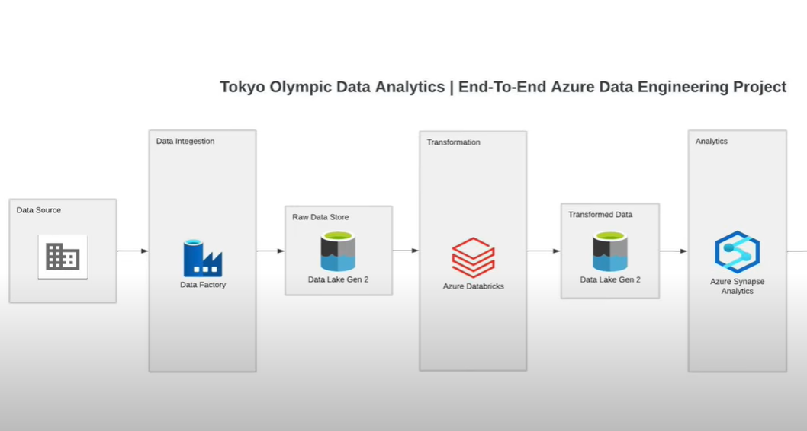

# Tokyo Olympics | Data Engineering Project

## Introduction

The goal of this project is to perform data analytics on Tokyo Olympic 2021 dataset using various tools and technologies, including Azure Data Factory, Azure Synapse Analytics, Data Lake Gen 2, and DataBricks.

## Architecture

## 📌 Project Workflow: Tokyo Olympic Data Analytics (End-to-End Azure Data Engineering)

This project implements a modern **data engineering pipeline** on Azure to analyze Olympic data.  
The process is divided into **four key phases**:

---

### **Phase 1: Data Ingestion**
- **Source**: Olympic dataset (CSV, API, or database).
- **Tool Used**: **Azure Data Factory (ADF)**.
- **Process**:
  - ADF connects to the external source.
  - Extracts raw data and loads it into **Azure Data Lake Storage Gen2** (Raw Zone).

---

### **Phase 2: Raw Data Storage**
- **Tool Used**: **Azure Data Lake Storage Gen2**.
- **Process**:
  - Stores the ingested data in its original/raw format.
  - Acts as the **single source of truth** for downstream processing.
  - Enables reprocessing without fetching from the source again.

---

### **Phase 3: Data Transformation**
- **Tool Used**: **Azure Databricks** (Apache Spark-based).
- **Process**:
  - Reads raw data from Data Lake.
  - Applies transformation logic (cleaning, joining, aggregations, schema standardization).
  - Writes the **business-ready datasets** back into Data Lake (Curated/Transformed Zone).

---

### **Phase 4: Analytics & Reporting**
- **Tool Used**: **Azure Synapse Analytics**.
- **Process**:
  - Connects to the transformed data in Data Lake.
  - Provides a powerful SQL-based analytics environment.
  - Models and queries data to extract insights.
  - Can be further connected to **Power BI** for dashboards and visualizations.

---

## Technology Used
- Programming language : Python

Azure Cloud Platform
- Azure Data Factory
- Azure Data Lake Gen 2
- Azure Synapse Analytics
- Azure DataBricks

## Dataset Used
Tokyo Olympics 2021: https://www.kaggle.com/datasets/arjunprasadsarkhel/2021-olympics-in-tokyo
